###

<div align="center">
  <h2>Hi, I'm Om Sonawane 👋</h2>
  <p style="color: gray; font-size: 18px;">Engineering Student & Aspiring Software Developer</p>
</div>

###

<h2 align="center">About me</h2>

<div align="center">
  
</div>

```json
{
  "developer": "Om Sonawane",
  "experience": "Creating bugs since 2022 ✨",
  "currently_learning": "Bash scripting & automation 📚",
  "the_dream": "Running my own browser inside my custom OS 🎯",
  "fun_fact": "I love Spider-Man (just two web devs doing our best) 🕸️"
}
```

###

<h2 align="left">I code with</h2>

###

<div align="left">
  
  
  
  
  
  
  
  
  
  
  
  
  
  
  
  
  
  
  
  
  
  
  
</div>

###

<div align="center">
  
</div>

###

<div align="left">
  <a href="https://www.linkedin.com/in/om-sonawane-a68814349/" target="_blank">
    
  </a>
  <a href="https://discord.com/users/neko1m" target="_blank">
    
  </a>
  <a href="https://www.hackerrank.com/profile/omsoanwane124421" target="_blank">
    
  </a>
  <a href="https://monkeytype.com/profile/Moon_cat" target="_blank">
    
  </a>
</div>


###
